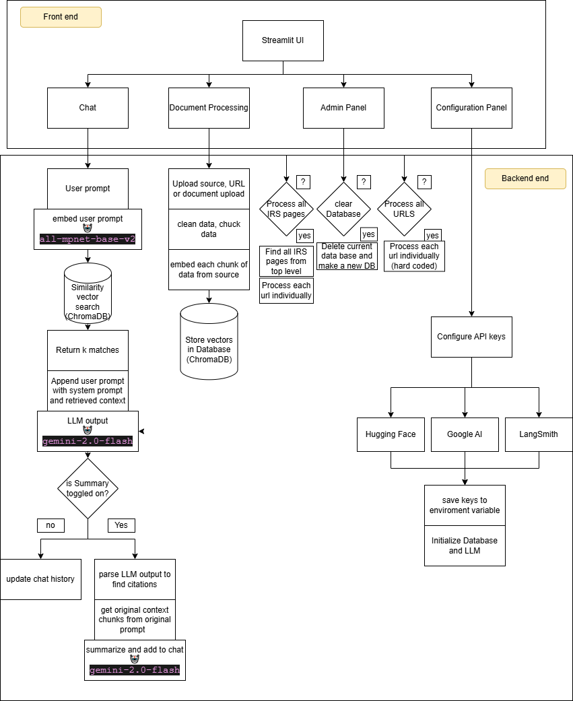
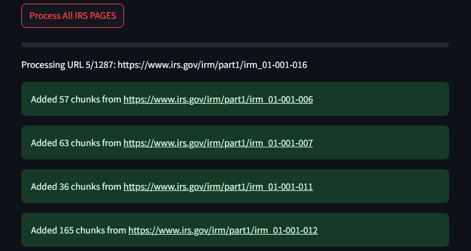

# IRS RAG Chatbot

> A Retrieval-Augmented Generation app that scrapes the entire **IRS Internal Revenue Manual** (~1,287 pages), embeds it into a vector database, and lets you chat with the corpus through a Streamlit interface — with inline citations and per-source summaries.

<p align="center">
  
</p>

<p align="center">
  
  
  
  
  
  
</p>

---

## What it does

- **Bulk-scrapes the IRS Internal Revenue Manual** end-to-end — walks the table of contents, follows every `partN/irm_*` link, and ingests them in one click.
- **Drop-in document chat** — PDF uploads and arbitrary URLs work the same way as IRS pages.
- **Cites its sources, then explains them** — answers come with bracketed citations (`[1]`, `[2]`…) and an optional second pass that summarizes each cited chunk in plain English.
- **Refuses to hallucinate** — if the retrieved context doesn't contain the answer, the prompt forces a literal *"I don't have that information"* with no citations.

## Why I built it

I wanted a project that exercised the full RAG stack without leaning on a hosted "chat with PDF" service. The IRS Manual was a deliberate pick: it's massive, hierarchical, full of cross-references, and the kind of document where a wrong answer with a confident citation is actively harmful — so the citation discipline and the "refuse if absent" guardrail were the parts I cared most about getting right.

## Bulk IRS ingestion

<p align="center">
  
</p>

One click walks the IRS Internal Revenue Manual table of contents, follows every `partN/irm_*` link, and streams each page through the ingestion path below.

## How it works

**Retrieval path:** user query → `all-mpnet-base-v2` embedding → ChromaDB top-k similarity search → cited context injected into a Gemini 2.0 Flash prompt → response parsed for `[n]` citations → cited chunks re-summarized in a second LLM call (toggleable).

**Ingestion path:** PDF (`PyMuPDF`, page-level with markdown tables) or URL (`WebBaseLoader`) → regex cleanup → `RecursiveCharacterTextSplitter` (1000 / 200 overlap) → embedded and persisted in ChromaDB.

## Tech stack

| Layer | Choice | Why |
|---|---|---|
| LLM | Gemini 2.0 Flash | Fast, cheap, generous free tier — good fit for a portfolio demo |
| Embeddings | `sentence-transformers/all-mpnet-base-v2` | Strong general-purpose model, runs locally, no API cost |
| Vector store | ChromaDB (persistent) | Zero-config local persistence; survives restarts |
| Orchestration | LangChain | Loaders, splitters, Chroma wrapper |
| PDF parsing | PyMuPDF | Preserves page boundaries + extracts tables as markdown |
| Web scraping | `WebBaseLoader` + `requests` + regex | Bulk-walks the IRS sitemap |
| UI | Streamlit | Minimal-effort UI for a single-user RAG demo |
| Tracing | LangSmith | Optional, for inspecting retrieval / prompt behavior |

## Run it locally

```bash
git clone https://github.com/T-Rzeznik/irs-rag-chatbot.git
cd irs-rag-chatbot
pip install -r requirements.txt
streamlit run app.py
```

Then either:

- Paste your API keys into the **API Keys** expander in the UI, **or**
- Copy `.env.example` to `.env`, fill it in, and they'll be picked up.

**Keys you'll need:** [HuggingFace](https://huggingface.co/settings/tokens), [Google AI Studio](https://aistudio.google.com/app/apikey), and (optional) [LangSmith](https://smith.langchain.com/).

## Project layout

```
.
├── app.py                  # Streamlit UI + chat + retrieval orchestration
├── document_processor.py   # PDF / URL ingestion + IRS bulk scraper
├── requirements.txt
├── .env.example
└── docs/                   # Architecture diagram + screenshots
```

## License

[MIT](LICENSE) — feel free to fork it, learn from it, or rip it apart.
